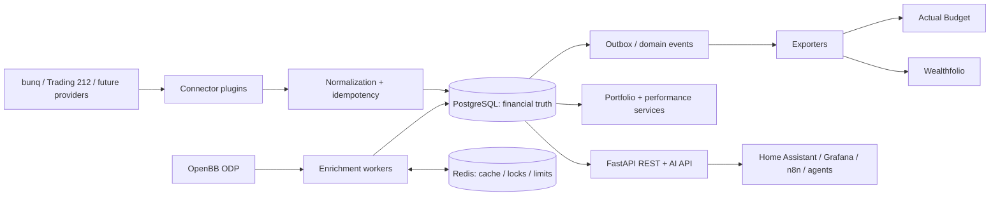

# Architecture

## 1. Executive summary

finance-sync is a self-hosted integration layer for personal-finance applications. It connects to financial institutions, stores normalized financial facts in PostgreSQL, enriches securities and prices via OpenBB, and exposes stable REST, event, exporter, and AI-oriented interfaces. Actual Budget consumes banking facts; Wealthfolio consumes investment facts. Neither needs credentials for bunq, Trading212, or market-data providers.

The initial deployment is one asynchronous FastAPI application process plus one scheduler/worker process, backed by PostgreSQL and Redis. This is a **modular monolith**: code boundaries are strict, but deployment remains simple on Docker/Coolify/Proxmox. It can later split the API, workers, and exporters without changing public contracts.



## 2. Boundary and ownership

| Layer | Owns | Must not own |
|---|---|---|
| Connector | Provider authentication, pagination, provider rate limits, raw payload capture | Business calculations or REST schemas |
| Normalization | Mapping to canonical commands/facts, identity reconciliation | Provider network calls |
| Domain services | Ledger, portfolio, performance, allocation, net-worth rules | HTTP/provider details |
| Enrichment | Security identity resolution, market metadata/prices, freshness policy | Transactional bank data |
| Exporter | Consumer-specific cursor/state and mapping | Source-of-truth financial records |
| API | Authentication, request validation, response projections | Direct SQL business logic |

Canonical models are the only cross-boundary data contract. Raw payloads are retained encrypted for traceability and re-normalization, but are never served to ordinary consumers.

## 3. Core modules and repository layout

```text
finance-sync/
  app/
    api/                 # FastAPI routers, dependencies, response DTOs
    auth/                # JWT, API keys, RBAC, credential crypto
    connectors/          # SDK, registry, bunq/, trading212/, fixtures/
    domain/              # entities, value objects, commands, policies
    enrichment/          # OpenBB gateway, resolution and freshness policies
    exporters/           # SDK, actual_budget/, wealthfolio/
    infrastructure/      # SQLAlchemy repositories, Redis, HTTP, outbox
    services/            # sync, portfolio, performance, net-worth, AI projections
    workers/             # APScheduler jobs, event consumers, retry dispatch
    observability/       # structured logs, metrics, tracing, health checks
    config/              # typed settings and dependency assembly
    main.py
  alembic/               # schema migrations only
  tests/
    unit/ integration/ contract/ e2e/ fixtures/
  docs/ adr/
  docker/                # Dockerfile, compose example, Coolify notes
  scripts/               # administrative/one-off commands
  pyproject.toml
  mkdocs.yml
```

Dependency direction is `api/workers -> services -> domain <- infrastructure/connectors/exporters`. SQLAlchemy mappings and Pydantic transport models are kept separate from domain value objects. All network and database I/O is async.

## 4. Synchronization flow

1. Scheduler or `POST /sync/{provider}` creates a `sync_run` with a unique request/idempotency key.
2. Connector Manager obtains a per-connection Redis lock and invokes the connector's incremental fetch methods, using persisted watermarks/cursors.
3. Raw responses are encrypted and fingerprinted; the normalizer converts records to canonical commands.
4. Repositories upsert immutable-or-versioned financial facts under database uniqueness constraints. A changed fact writes an outbox event in the **same transaction**.
5. An outbox dispatcher publishes events to in-process consumers initially and records delivery attempts. Consumers update projections, schedule enrichment, and advance exporter cursors.
6. Sync ends with counts, cursor, warnings, and a durable audit trail. Retryable failures use exponential backoff; reconciliation jobs repair missed/changed history.

The initial event bus is the PostgreSQL transactional outbox plus worker consumers. Redis Pub/Sub is optional for low-latency notifications only; it is never the durable source of an event. A future broker adapter (NATS/Kafka/RabbitMQ) consumes the same outbox contract.

### Connector and exporter SDKs

Each connector package declares a manifest (`key`, semantic `api_version`, capabilities, credential schema, rate-limit policy) and implements one async protocol. Optional resources are capability-gated rather than faked with empty methods.

| Async operation | Result / responsibility |
|---|---|
| `authenticate`, `health` | Validate credentials and report a safe connection-health state. |
| `accounts`, `balances`, `transactions` | Return cursor-paged provider banking records. |
| `holdings`, `orders`, `dividends` | Return cursor-paged provider investment records. |
| `sync` | Orchestrate selected resource fetches and return counts, watermarks, warnings, and retryable error classification. |

`cards`, `scheduled_payments`, and `payment_requests` use the same paged resource pattern. The connector returns only internal provider DTOs; a paired `Normalizer` maps them to canonical commands. The registry discovers built-ins and Python entry points in group `finance_sync.connectors`, validates compatible SDK versions, and refuses duplicate keys. Connector tests must prove pagination, cursor advancement, retry classification, mapping fixtures, and idempotent replay.

Exporter packages similarly expose `capabilities()`, `validate_configuration()`, `deliver(event, projection)`, and `health()`. Exporters consume canonical projections and never provider DTOs.

### Event contract

An event envelope is `{id, type, version, tenantId, aggregateType, aggregateId, occurredAt, correlationId, causationId, payload}`. Types include `transaction.created`, `transaction.updated`, `holding.updated`, `holding.deleted`, `price.updated`, `dividend.received`, `portfolio.changed`, `networth.changed`, `sync.completed`, and `sync.failed`. Payloads carry stable IDs and summary facts, not encrypted raw payloads. Consumers record event/version handling in `event_delivery`; unknown newer versions are retained and alerted rather than silently misinterpreted.

### OpenBB enrichment and cache policy

The OpenBB gateway accepts canonical listing/identifier queries and returns source-attributed observations. Resolution prefers ISIN/FIGI, then provider instrument ID mappings, then symbol + MIC + currency; uncertain matches are queued for review and never silently merge securities. Redis uses namespaced cache keys such as `market:price:{listing}:{granularity}` with stale-while-revalidate. Suggested maxima: latest prices 20 minutes during market hours / 24 hours otherwise; EOD prices immutable; company profile 30 days; fundamentals 7 days; ETF metadata 30 days; FX 15 minutes. PostgreSQL remains the provenance-bearing durable cache, and every response reports `observedAt`, `source`, and freshness.

## 5. Scheduler policy

| Job | Cadence | Notes |
|---|---:|---|
| bunq balances and transactions | 15 min | Incremental plus pending-to-booked reconciliation |
| bunq cards/scheduled payments | hourly | Daily full reconciliation |
| Trading212 portfolio/cash/orders/dividends | hourly | Respect provider limits and market status |
| price refresh | 15 min in relevant market hours | Stale-while-revalidate cache |
| security fundamentals/ETF metadata | weekly | Per-security freshness policy |
| nightly reconciliation | daily | Re-fetch rolling history and validate balances |
| exporter delivery | event-driven + 5 min sweep | Cursor-based and idempotent |
| health checks | 5 min | Dependency and credential-health checks |

APScheduler runs only in the worker deployment, not every API replica. PostgreSQL advisory locks ensure one scheduler leader.

## 6. Deployment architecture

Coolify deploys a compose stack on Proxmox:

```text
public/LAN -> reverse proxy -> finance-sync-api (stateless, replicas allowed)
                         -> finance-sync-worker (one scheduler leader, scalable consumers)
                         -> PostgreSQL 16+ (persistent volume, backups)
                         -> Redis 7+ (persistent optional; cache/locks only)
```

Use separate database users for runtime and migration jobs. Apply Alembic migrations as a one-shot release step before API/worker rollout. Put provider keys, encryption master key, JWT signing keys, and exporter credentials in Coolify secrets; never image layers, `.env` commits, logs, or raw event payloads. Back up PostgreSQL with encrypted off-host retention and test restore quarterly.

## 7. Security model

- Human/API clients authenticate with short-lived JWT access tokens and rotated refresh tokens; machine integrations use hashed, scoped API keys.
- Roles: `admin` (connections/secrets/config), `operator` (sync/retry/read), `reader` (read projections), `exporter` (only exporter delivery), `ai_reader` (read-only AI endpoints).
- Connector credentials are envelope-encrypted (AES-256-GCM data encryption key wrapped by a deployment-managed master key); decrypt only inside connector execution.
- REST scope is tenant-aware from day one even if the first deployment has one tenant. Every financial table includes `tenant_id`; authorization always filters it.
- Apply per-principal and per-IP rate limits in Redis, request-size limits, CORS allowlists, TLS, secret redaction, audit logs, and dependency/image scanning.
- Do not put account numbers, tokens, or transaction descriptions into metrics labels. Logs use correlation IDs and redacted structured fields.

## 8. Exporter design

Exporters subscribe to canonical events and periodically sweep source revisions. They persist `export_delivery` rows keyed by exporter, target, source event and payload version; retries therefore cannot create duplicate downstream effects.

Actual Budget is banking-only: map canonical accounts, balance snapshots, and booked transactions. It never receives holdings or security enrichment. Wealthfolio is investment-only: map portfolios, holdings, trade transactions, dividends, cash positions and performance snapshots. Each exporter is an adapter with an explicitly configured target endpoint and API credential. Exact downstream endpoint mapping is a phase-4 contract-test discovery task, not an assumed API.

## 9. Home Assistant and AI projections

Home Assistant begins as a pull integration using `/api/v1/ha/state`, with stable sensor IDs: net worth, portfolio value, cash balance, trailing-12-month dividends, current-month expenses, investment gain, allocation, and daily performance. Webhook/MQTT push is a later optional adapter.

AI endpoints return compact, deterministic JSON summaries with `as_of`, currency, coverage, freshness, source counts, and explicit null/unknown values. They exclude raw credentials and default to aggregate data. An optional MCP server later wraps these same API services; it introduces no second business layer.
